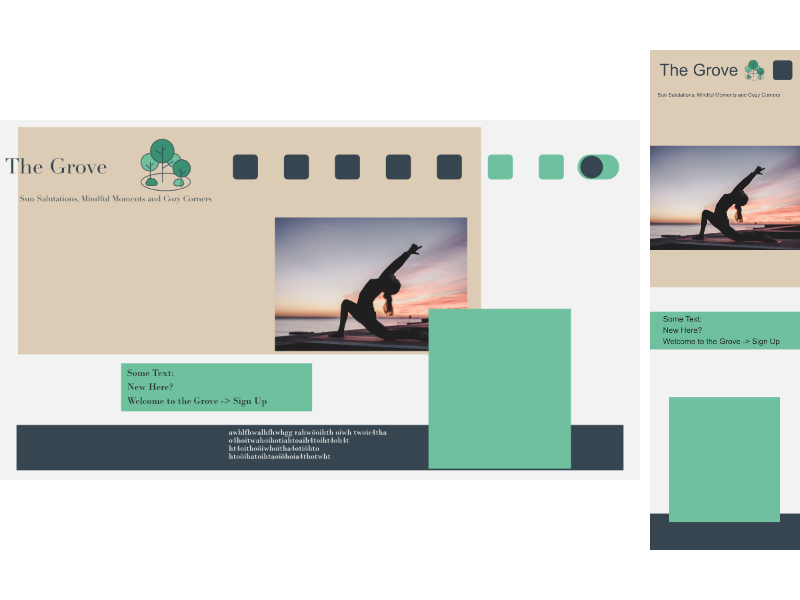
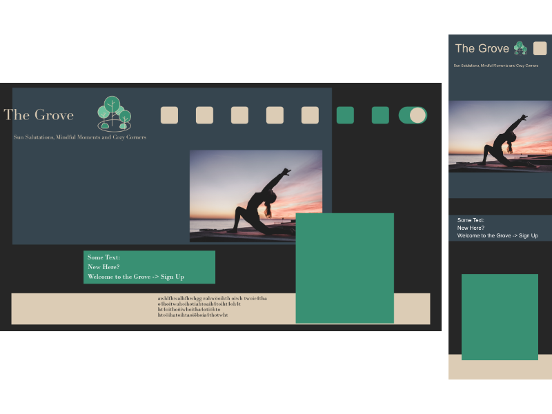

# The Grove
 ## summary
 * to have a bigger project with JavaScript I can work on  
 * to learn more about sass
 ## built with:
 * HTML 5  
 * SCSS (with the pure-JavaScript package built from the Dart Sass 1.66.1 implementation)  
 * (npm: '9.8.1' node: '18.12.1')
 ## getting started:
 to use the scss-files sass has to be installed:  
 via npm:  

    npm install -g sass
 other options are available on the [sass website](https://sass-lang.com/install/)

 using the sass command to compile scss-files to css-files:

    sass --watch input.scss output.css

 [how to install node.js and npm](https://docs.npmjs.com/downloading-and-installing-node-js-and-npm)
 ## other:
 ### license:
 The files in [employees](assets/images/employees/) and [studio](assets/images/studio/) are distributed under [pixabays-license](https://pixabay.com/de/service/terms/). The files in [illustrations](assets/images/illustrations/) are distributed under [CC BY-SA 4.0](https://creativecommons.org/licenses/by-sa/4.0/) and the author is [Viktoria Fieberg](https://github.com/fiebergviktoria). Everything else is distributed under [MIT license](https://spdx.org/licenses/MIT.html).
 See [license.md](LICENSE.md) for more information.
 ### resources:
 * Sass Basics: [Sass Guide](https://sass-lang.com/guide/)  
 * Sass Architecture: [Sass Guidelines](https://sass-guidelin.es/#about-sass)  
 ### contact:
 * [github](https://github.com/fiebergviktoria)  
 * [repository](https://github.com/fiebergviktoria/the_grove)
 ## mockups: 
  
  
